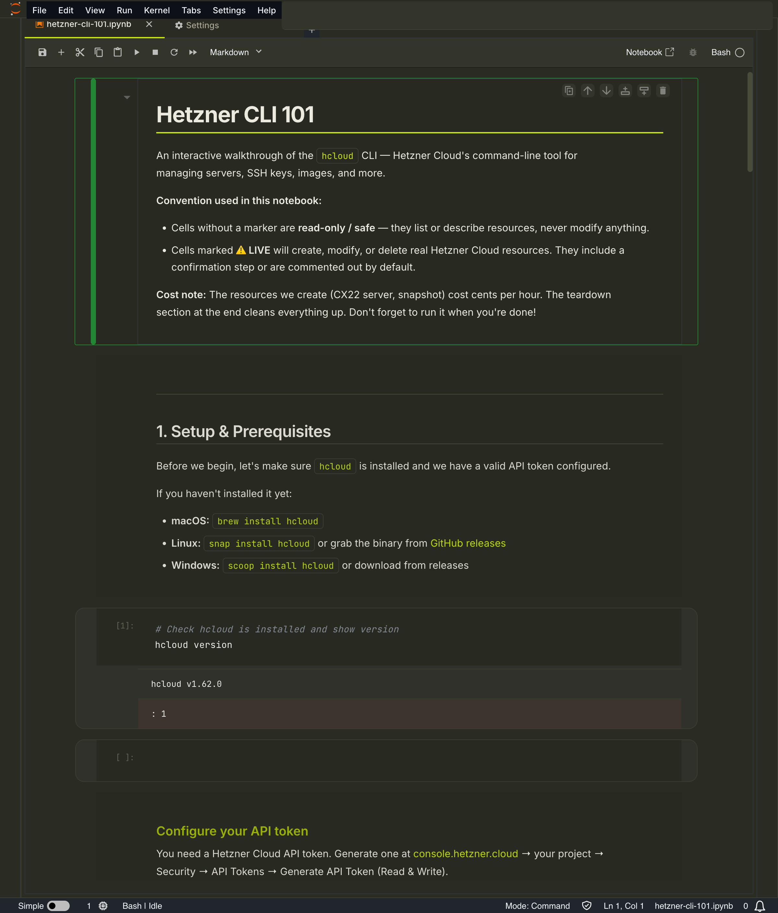
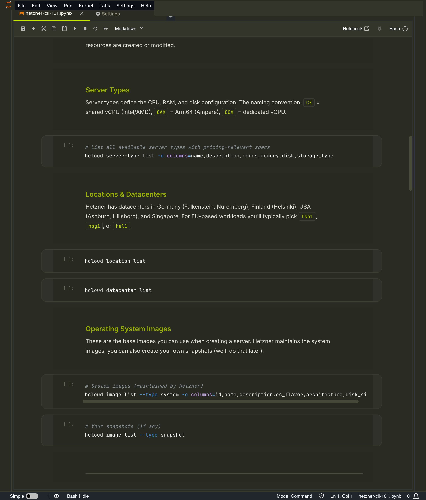

# Hetzner CLI 101

An interactive Jupyter notebook walkthrough of the `hcloud` CLI — Hetzner Cloud's command-line tool for managing servers, SSH keys, images, and more.

Built for [Yorizon](https://yorizon.io) with a custom dark theme designed to be beginner-friendly.





## What you'll learn

- Install and configure the `hcloud` CLI
- Explore server types, locations, datacenters, and OS images
- Manage SSH keys at the project level
- Create, inspect, SSH into, and destroy a server
- Take and manage snapshots
- Use different output formats (table, JSON, YAML) for scripting

## Quick start

### Prerequisites

- [uv](https://docs.astral.sh/uv/) (Python package manager)
- [hcloud](https://github.com/hetznercloud/cli) CLI installed
- A Hetzner Cloud API token ([generate one here](https://console.hetzner.cloud/))

### Run the notebook

```bash
git clone https://github.com/Yorizon-product/y_hetzner.git
cd y_hetzner
uv sync
./start-notebook.sh
```

This installs dependencies, applies the Yorizon theme, and opens the notebook in JupyterLab.

### Apply the theme

The Yorizon theme loads automatically when you open the notebook through JupyterLab. After the notebook opens in your browser, run this in the browser console (Cmd+Option+J) to apply the custom styling:

```js
fetch('/files/yorizon-theme.css').then(r => r.text()).then(css => {
  const s = document.createElement('style'); s.textContent = css;
  const f = document.createElement('link'); f.rel = 'stylesheet';
  f.href = 'https://fonts.googleapis.com/css2?family=Inter:wght@300;400;500;600;700&family=JetBrains+Mono:wght@400;500&display=swap';
  document.head.append(f, s);
});
```

## Safety conventions

The notebook uses a clear convention so you always know what's safe:

- **Unmarked cells** are read-only — they list or describe resources, never modify anything
- **Cells marked with LIVE** create, modify, or delete real Hetzner Cloud resources — they're commented out by default

## Cost note

The demo creates a CX22 server (~0.006 EUR/hour) and optionally a snapshot. The teardown section at the end cleans everything up. Don't forget to run it when you're done.

## Project structure

```
hetzner-cli-101.ipynb   # The notebook
yorizon-theme.css       # Custom JupyterLab theme (Yorizon brand)
start-notebook.sh       # Launch script
pyproject.toml          # Python/uv project config
```

## License

MIT
